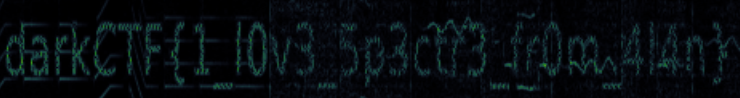

# AW - FOREN - 309pts.
## Description
"Hello, hello, Can you hear me, as I scream your Flag! "

## Attachments
> [Spectre.mp4](https://mega.nz/file/O19ilb5L#VfJFpu9XIqGOpouDYC7TQMsGDRpVyc1pXBWGDx4oXPk)

## Solution
As the file name suggested the first thing i did was analyzing the spectrum of the provided file with Sonic Visualiser
and found the flag at about half of the song.

`darkCTF{1_l0v3_5p3ctr3_fr0m_4l4n}`
