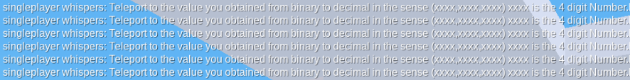
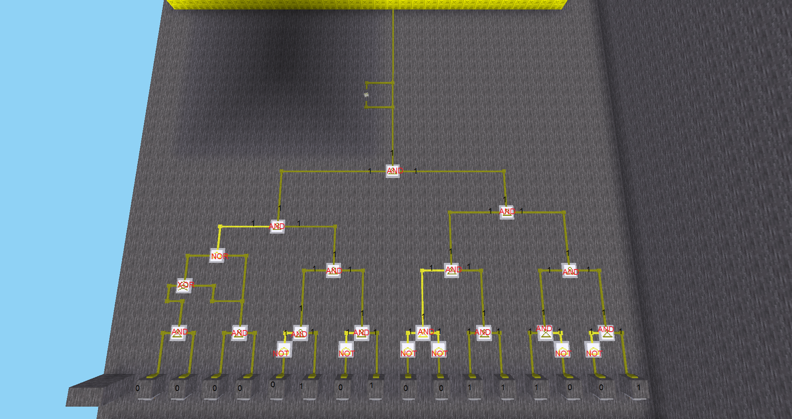
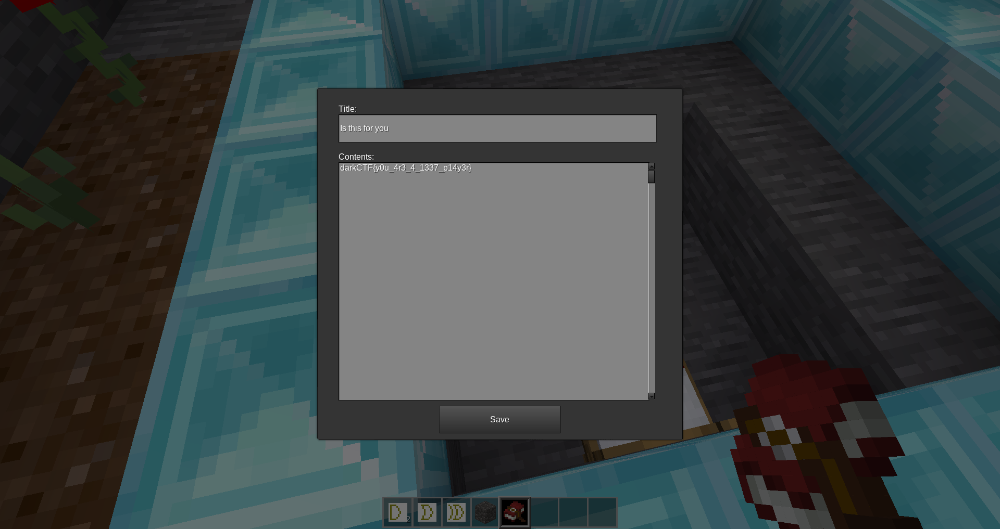

## Minetest 2 - MISC - 432pts.
# Description
Someone messed up my world someone please help me recover my flag. Same file from Minetest 1

## Attachments
_None_

## Solution

After solving [Minetest 1](../minetest-1) i had to teleport to the value obtained from binary to decimal by solving the circuit.

Since i solved the previous challenge by placing the NOT gate i still had to reverse the circuit, but it turned out
to be quite easy.

I proceeded to convert the binary value to decimal and got `1337` (a classic).
I made sure to have the permission to use the teleport command with `/grant singleplayer all` then i teleported myself
with `/teleport 1337,1337,1337`.
Once teleported i found myself in a small building surrounded by some bookshelves in which i found a book with the flag written inside.

`darkCTF{y0u_4r3_4_1337_p14y3r}`
