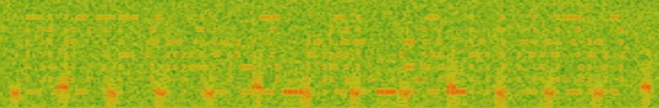
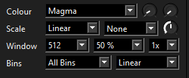
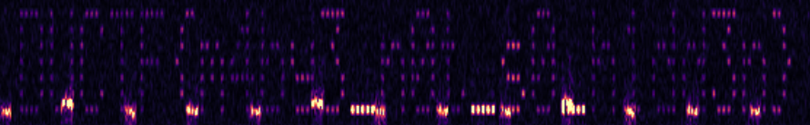

# On the spectrum - FOREN - 100pts.
## Description
My friend has been sending me lots of WAV files, I think he is trying to communicate with me, what is the message he sent?

## Attachments
###### [message_1.wav](message_1.wav)

## Solution

After hearing `message_1.wav` i tried to analyze its spectrum with Sonic Visualiser and found something that looked like a string.

It was pretty much unreadable so i tried tweaking some settings to enhance it a bit.

A this point the image was clear enough to read the flag.

flag: `DUCTF{m4by3_n0t_s0_h1dd3n}`
